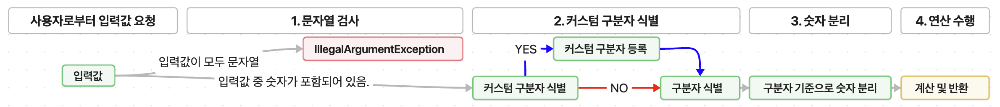

# kotlin-calculator-precourse
# 1주차 프리코스
## 기능 및 요구 사항
 - 목표: 입력한 문자열에서 숫자를 추출하여 더하는 계산기를 구현한다.
 - 요구 사항
   - 쉼표(,) 또는 콜론(:)을 구분자로 가지는 문자열을 전달하는 경우 구분자를 기준으로 분리한 각 숫자의 합을 반환한다.
     예: "" => 0, "1,2" => 3, "1,2,3" => 6, "1,2:3" => 6
 - 앞의 기본 구분자(쉼표, 콜론) 외에 커스텀 구분자를 지정할 수 있다. 커스텀 구분자는 문자열 앞부분의 "//"와 "\n" 사이에 위치하는 문자를 커스텀 구분자로 사용한다.
   - 예를 들어 "//;\n1;2;3"과 같이 값을 입력할 경우 커스텀 구분자는 세미콜론(;)이며, 결과 값은 6이 반환되어야 한다.
 - 사용자가 잘못된 값을 입력할 경우 IllegalArgumentException을 발생시킨 후 애플리케이션은 종료되어야 한다.

## 과제 진행 및 프로그래밍 요구 사항.
 - 깃(git)의 커밋 단위는 앞 단계에서 README.md에 정리한 기능 목록 단위로 추가함.
   - [AngularJS Git Commit Message Conventions](https://gist.github.com/stephenparish/9941e89d80e2bc58a153)을 참고해 커밋 메시지를 작성함.
   - 자세한 과제 진행 방법은 [프리코스 진행 가이드 문서](https://github.com/woowacourse/woowacourse-docs/tree/main/precourse)를 참고함.
   - Kotiln 1.9.24에서 실행 가능해야 함.
   - 프로그램 실행의 시작점은 Application의 main()임.
   - build.gradle.kts 파일은 변경할 수 없으며, 제공된 라이브러리 이외의 외부 라이브러리는 사용하지 않음.
   - 프로그램 종료 시 System.exit() 또는 exitProcess()를 호출하지 않음.
   - 프로그램 요구 사항에서 달리 명시하지 않는 한 파일, 패키지 등의 이름을 바꾸거나 이동하지 않는다.
   - Kotilne 코드 컨벤션을 지키면서 프로그래밍 한다.
     - Kotilne Style Guide 참고.
   - 라이브러리: camp.nextstep.edu.missionutils에서 제공하는 Console API를 사용하여 구현해야함.
     - 사용자가 입력하는 값은 camp.nextstep.edu.missionutils.Console의 readLine()를 활용함.

## 제출 방법
- 우아한 테크코스 [제출 가이드](https://github.com/woowacourse/woowacourse-docs/tree/main/precourse#제출-가이드)

## 기능 구현!

1. 문자열 검사
    - 입력값이 null인지 검사.
    - 입력값에 숫자가 포함되어 있는지 검사.
    - 검사를 통과하지 못하면 IllegalArgumentException을 발생시키며 프로그램 종료.
    - 검사 통과 시, firstCheck 변수를 true로 반환하며 프로그램 다음 기능 동작.

2. 커스텀 구분자 식별

3. 숫자 분리

4. 연산 수행

