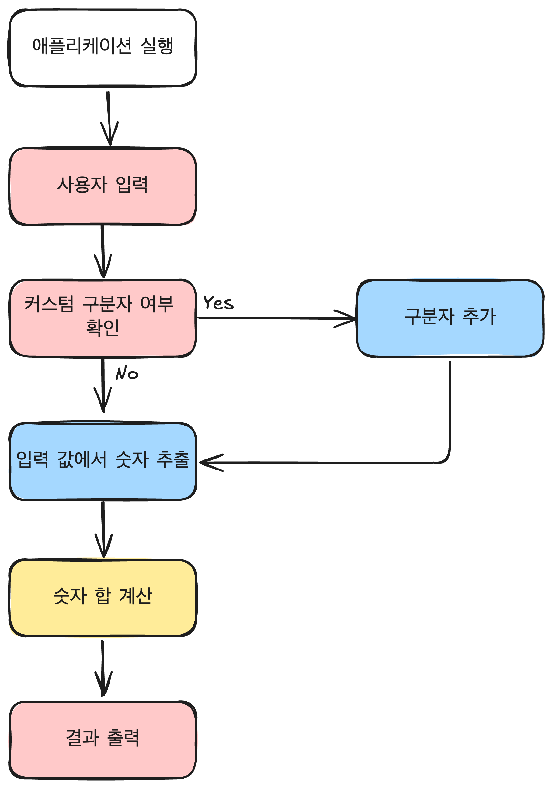

# 문자열 덧셈 계산기

사용자가 입력한 문자열에서 숫자를 추출하여 더하는 계산기를 구현한다.

## 과제 진행 요구 사항

- 구현할 기능을 `README.md`에 정리한다.
- Git 커밋 단위는 기능 목록 단위로 한다.
    - Git 커밋은 [AngularJS Git Commit Message Conventions](https://gist.github.com/stephenparish/9941e89d80e2bc58a153)을
      기반으로 한다.

## 구현할 기능 목록 및 요구 사항

기능 개발(커밋) 단위는 굵은 글씨를 기준으로 한다.

- 구분자를 기준으로 숫자 추출
    - **구분자 추가**
        - 구분자 목록에 사용자 정의 구분자를 추가한다.
    - **문자열 검사**
        - 입력된 문자열이 숫자와 구분자로만 이루어져 있는지 확인한다.
        - 이외의 값이 있는 경우 `IllegalArgumentException` 예외를 반환한다.
    - **입력된 문자열을 등록된 구분자를 기준으로 숫자 추출**
        - 문자열에 이상이 없는지 검사한다.
        - 기본 구분자는 쉼표(`,`) 또는 콜론(`:`)으로 한다.
        - 기본 구분자와 커스텀 구분자를 기준으로 숫자를 추출한다.
        - 숫자는 배열로 반환한다.
- **배열로 받은 숫자를 합하여 반환**
    - 합하는 과정에서 값이 커 범위를 초과하는 경우 `IllegalArgumentException` 예외를 반환
- **사용자의 입력을 받고 결과를 출력**
    - 문자열을 입력하는 메시지를 출력한다.
        - 출력 내용은 `덧셈할 문자열을 입력해 주세요.`이다.
    - 사용자의 입력은 `camp.nextstep.edu.missionutils.Console`의 `readLine()`를 사용한다.
    - 사용자의 입력이 `//${구분자}\n`으로 시작하는 경우, `//`와 `\n` 위치한 문자를 구분자로 추가한다.
        - `//`와 `\n` 사이에 위치한 문자가 1개를 **초과**할 경우 `IllegalArgumentException` 예외를 반환한다.
    - 계산할 문자열을 숫자 배열로 변환 요청한다.
    - 숫자 배열을 합치는 계산 과정을 거치고 사용자에게 결과를 출력한다.
        - 결과 내용은 `결과 : ${결과}` 형식을 따른다.

## 프로그래밍 요구 사항

- `Kotlin 1.9.24` 버전에서 실행 가능해야 한다.
- Kotlin 코드만을 사용해서 구현해야 한다.
- 프로그램의 실행 시작점은 `Application`의 `main()`이다.
- `build.gradle.kts` 파일은 변경할 수 없다. 제공된 라이브러리 이외의 외부 라이브러리는 사용하지 않아야 한다.
- 프로그램 종료 시 `System.exit()` 혹은 `exitProcess()`를 호출하지 않아야 한다.
- 프로그래밍 요구 사항에서 달리 명시하지 않는 한 `파일`, `패키지` 등의 이름을 바꾸거나 이동하지 않는다.
- [Kotlin Style Guide](https://kotlinlang.org/docs/coding-conventions.html)
- 사용자의 입력은 `camp.nextstep.edu.missionutils.Console`의 `readLine()`을 활용하여 입력받는다.

## 작동 흐름



블럭의 색상을 통해 클래스를 구분한다.

## 사용자의 입력 예시

### 예시 1

입력

```
1,2:3
```

결과

```
결과 : 6
```

### 예시 2

입력

```
//;\n1;2;3
```

결과

```
결과 : 6
```