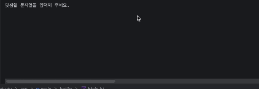

<p align="center">
    
</p>

🚀 kotlin-calculator-precourse-week 1
===

<hr style="height: 3px; border: none; background-color: #333;" />


> 우아한 테크코스 7기 모바일 프리코스 1주차 과제 저장소입니다.

<br>



# 목차

---

- [시작하기](#시작하기)
- [과제 개요](#과제-개요)
- [기능 요구 사항](#기능-요구-사항)
- [프로그래밍 요구 사항](#프로그래밍-요구-사항)
- [기능 목록 with keypoint](#기능-목록-with-keypoint)


# 시작하기

---

레포지토리를 Clone 하고 IDE에서 애플리케이션을 실행합니다.

```git
git clone -b as --single-branch https://github.com/YooGyeongMo/kotlin-calculator-7.git
```

# 과제 개요

---

이 과제는 문자열 덧셈 계산기를 구현한 것입니다.</br>
주어진 문자열에서 숫자를 추출하여 더하는 방식으로 동작하며, 쉼표(,) 또는 콜론(:)을 구분자로 사용하여 각 숫자를 분리하고, 최종적으로 더한 결과를 반환합니다.


# 기능 요구 사항

---

- 입력한 문자열에서 쉼표(,) 또는 콜론(:)을 기준으로 숫자를 추출하여 더한 결과를 반환한다.
    - 입출력 예시 - "1,2,3" => 6

- 기본 구분자 외에, 커스텀 구분자도 사용할 수 있습니다.
    - 커스텀 구분자는 "//" 와 "\n" 사이에 위치하는 문자를 구분자로 사용합니다.
    - 입출력 예시 - "1,2,3" => 6
- 잘못된 값이 입력된 경우, IllegalArgumentException을 발생시키며 프로그램이 종료됩니다.

# 프로그래밍 요구 사항

---

- Kotlin 1.9.24에서 실행 가능해야함.
- Only Kotlin 코드로만 구현.
- 프로그램 실행의 시작점은 Application의 main()이다.
- 프로그램 종료 시 System.exit() 또는 exitProcess()를 호출하지 않는다.
- 코틀린 코드 컨벤션을 지키면서 프로그래밍한다.
- 프로그래밍 요구 사항에서 달리 명시하지 않는 한 파일, 패키지 등의 이름을 바꾸거나 이동하지 않는다.
- build.gradle.kts 파일은 변경할 수 없으며, 제공된 라이브러리 이외의 외부 라이브러리는 사용하지 않는다.

# 기능 목록 with keypoint

---

- 사용자가 빈 문자열을 입력하면, 결과 값으로 0을 반환.
- 쉼표(,) 또는 콜론(:) 구분자 처리
    - keypoint: 두 구분자 혼합 사용 시에도 각 숫자를 분리할 수 있어야함.
- 커스텀 구분자 처리
    - 입력 문자열 "//", "\n" 사이에 위치한 문자를 커스텀 구분자로 지정할 수 있어야함.
    - keypoint: 구분자 사이 인덱스와 구분자 뒤 인덱스를 구별 잘해야함.
    - keypoint2: 사용자가 "\n"를 입력할 시에 실제 개행으로 인식하는지, 이스케이프 문자로 처리되는지 확인해서 기능을 구현해야함.
- 숫자 아닌 값이 포함된 경우 예외 처리
    - 입력 문자열이 숫자가 아닌 값이 포함된 경우 IllegalArgumentException 예외를 발생. -> 프로그램이 종료되면 안된다.
- 음수가 포함된 경우 예외 처리
    - 음수 값이 포함된 경우 IllegalArgumentException 예외를 발생. -> 프로그램이 종료되면 안된다.
- 숫자의 합 계산
    - 분리된 숫자들을 모두 더한 결과를 반환