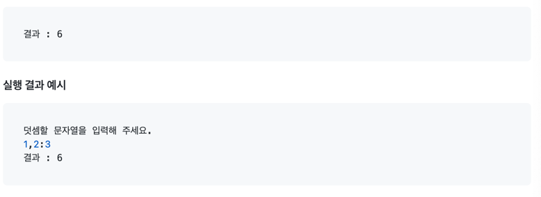

# kotlin-calculator-precourse

## 구현할 기능
- [X] Console API를 통한 문자열 입력
- [ ] 문자열에서 숫자만 추출하기 위한 정규표현식 작성
- [ ] 정규표현식을 통해 구분자로 구분된 문자가 숫자인지 확인 후 리스트에 저장
- [ ] 추출한 숫자의 합 출력
- [ ] 예외처리
- [ ] 테스트 코드 작성

## 구현 과정
### Console API를 통한 문자열 출력
camp.nextstep.edu.missionutils.Console의 readLine()을 통해 입력을 받도록 명시되어 있다.

그렇기에 먼저 camp.nextstep.edu.missionutils.Console 라이브러리를 import한 뒤 그냥 readLine()을 통해 입력을 받으면 기본  kotlin.io의 readLine()을 사용하게 된다.

그렇기에 "Console.readLine()"을 통해 입력을 받는다.

```
package calculator
import camp.nextstep.edu.missionutils.Console
fun main() {
    val input = Console.readLine()
    println(input)
}
```

+ 실행 결과



### 문자열에서 숫자만 추출하기 위한 정규표현식 작성
+ 정규표현식을 작성하던 중 기존에 커스텀 기능을 기본 구분자를 구분하는 정규표현식을 작성 후 추가하려 했으나 한번에 진행하는 것이 보다 용이할 것으로 판단하여 구현할 기능 수정

