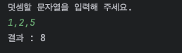

# kotlin-calculator-precourse

# 문자열 덧셈 계산기

## 과제 진행 요구 사항
- 미션은 문자열 덧셈 계산기 저장소를 포크하고 클론하는 것으로 시작한다.
- 기능을 구현하기 전 README.md에 구현할 기능 목록을 정리해 추가한다.
- Git의 커밋 단위는 앞 단계에서 README.md에 정리한 기능 목록 단위로 추가한다.
  - AngularJS Git Commit Message Conventions을 참고해 커밋 메시지를 작성한다.
- 자세한 과제 진행 방법은 프리코스 진행 가이드 문서를 참고한다.

## 기능 요구 사항
입력한 문자열에서 숫자를 추출하여 더하는 계산기를 구현한다.

- 쉼표(,) 또는 콜론(:)을 구분자로 가지는 문자열을 전달하는 경우 구분자를 기준으로 분리한 각 숫자의 합을 반환한다.
  - 예: "" => 0, "1,2" => 3, "1,2,3" => 6, "1,2:3" => 6
- 앞의 기본 구분자(쉼표, 콜론) 외에 커스텀 구분자를 지정할 수 있다. 커스텀 구분자는 문자열 앞부분의 "//"와 "\n" 사이에 위치하는 문자를 커스텀 구분자로 사용한다.
  - 예를 들어 "//;\n1;2;3"과 같이 값을 입력할 경우 커스텀 구분자는 세미콜론(;)이며, 결과 값은 6이 반환되어야 한다.
- 사용자가 잘못된 값을 입력할 경우 IllegalArgumentException을 발생시킨 후 애플리케이션은 종료되어야 한다.

## 입출력 요구 사항
### 입력
- 구분자와 양수로 구성된 문자열 

### 출력
- 덧셈 결과
```
결과 : 6
```


### 실행 결과 예시
```
덧셈할 문자열을 입력해 주세요.
1,2:3
결과 : 6
```


## 프로그래밍 요구 사항
- Kotlin 1.9.24에서 실행 가능해야 한다.
- Java 코드가 아닌 Kotlin 코드로만 구현해야 한다.
- 프로그램 실행의 시작점은 Application의 main()이다.
- build.gradle.kts 파일은 변경할 수 없으며, 제공된 라이브러리 이외의 외부 라이브러리는 사용하지 않는다.
- 프로그램 종료 시 System.exit() 또는 exitProcess()를 호출하지 않는다.
- 프로그래밍 요구 사항에서 달리 명시하지 않는 한 파일, 패키지 등의 이름을 바꾸거나 이동하지 않는다.
- 코틀린 코드 컨벤션을 지키면서 프로그래밍한다.
- 기본적으로 Kotlin Style Guide를 원칙으로 한다.

## 라이브러리
- camp.nextstep.edu.missionutils에서 제공하는 Console API를 사용하여 구현해야 한다.
  - 사용자가 입력하는 값은 camp.nextstep.edu.missionutils.Console의 readLine()을 활용한다.


## 구현할 기능 목록
- [X] 문자열은 missionutils에서 제공하는 라이브러리의 readline()을 사용하여 입력받는다.
- [X] 입력받은 문자열에서 쉽표(,) 또는 콜론(:) 을 구분하여 숫자를 분리하여 합을 반환한다.
- [X] 위의 구분자 외에 커스텀 구분자를 지정할 수 있는데, 이 경우에는 문자열 앞 부분의 `//`, `\n` 사이에 들어오는 문자를 구분자로 지정한다.
  - 커스텀 구분자를 지정할 경우 '//', '\n' 사이에 들어오는 문자가 한개인지 확인하고, 아니면 IllegalArgumentException을 발생시킨다.
- [X] 사용자가 잘못된 값을 입력할 경우 IllegalArgumentException을 발생시킨 후 애플리케이션을 종료시킨다.

## 문제 해결 과정

### 입력
```kotlin
    println("덧셈할 문자열을 입력해 주세요.")

    val inputString = readLine()

    if(inputString.isEmpty()) {
        throw IllegalArgumentException("Empty String.")
    }
```
- 미션의 요구사항인 camp.nextstep.edu.missionutils.Console의 readLine() 을 사용해서 입력을 받았음.
- 그리고 입력값이 없으면 IllegalArgumentException이 발생되도록 함.

### 기본 구분자
```kotlin
fun processDefaultDelimiter(inputString : String) : Int {   //기본 구분자 처리 함수
    val numberList = inputString.split(',',':')
    if(numberList.any { it.isEmpty() }) throw IllegalArgumentException()

    validateNumber(numberList)

    return numberList.sumOf { it.toInt() }
}
```
- `split`을 사용하여 입력받은 문자열에서 `,`, `:` 을 분리한 후 그 값들을 `toInt()`로 정수화 한 뒤 `sumOf`를 사용해서 더해주었음.

### 커스텀 구분자
```kotlin
fun processCustomDelimiter(inputString : String) : Int {    //커스텀 구분자 처리 함수
    val endIndex = inputString.indexOf("\\n")
    if(endIndex == -1) throw IllegalArgumentException()    //\n 이 없는 경우

    val customDelimiter = inputString.substring(2, endIndex)
    if(customDelimiter.isEmpty()) throw IllegalArgumentException()     //구분자가 없는 경우

    val numbers = inputString.substring(endIndex + 2)
    if(numbers.isEmpty()) throw IllegalArgumentException()  //숫자가 없는 경우

    val numberList = numbers.split(customDelimiter)
    if(numberList.any { it.isEmpty() }) throw IllegalArgumentException()    //구분자 사이에 숫자가 없는 경우

    validateNumber(numberList)

    return numberList.sumOf { it.toInt() }
}
```
- `'\'` 는 인식이 안되어 `\\n`을 사용해서 인식되도록 함.
- 커스텀 구분자의 경우에는 조건문을 사용하여 입력값의 시작이 `//`인 경우에만 검사하도록 함.
- 예외 처리 케이스로 아래의 케이스들을 검사하도록 함.
  - `\n` 이 없는 경우
  - `//`, `\n` 사이에 아무 문자가 없는 경우
  - 숫자가 없는 경우
  - 구분자 사이에 숫자가 없는 경우


### 숫자 체크 로직
```kotlin
fun validateNumber(numbers : List<String>) {    //숫자 체크 함수
    for(number in numbers) {
        if(number.isNotEmpty() && !number.all { it.isDigit() }) {
            throw IllegalArgumentException()
        }
    }
}
```
- 입력된 값이 숫자인지 아닌지 검사하는 함수


### 실행 결과
- 기본 구분자
  - `,`

  

  - `:`

  

- 커스텀 구분자


- 예외처리
1. 입력값이 숫자로 시작하지 않은 경우


2. 구분자 사이에 값이 비어있는 경우


## 에러 발생

- 컴파일 도중 해당 에러가 발생하여 프로젝트의 SDK 버전을 21로 설정해주니 해결되었음. 
